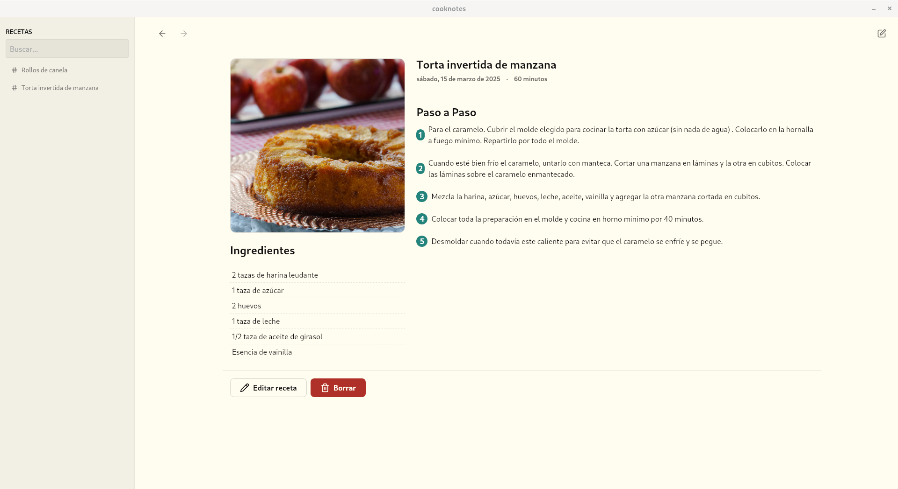
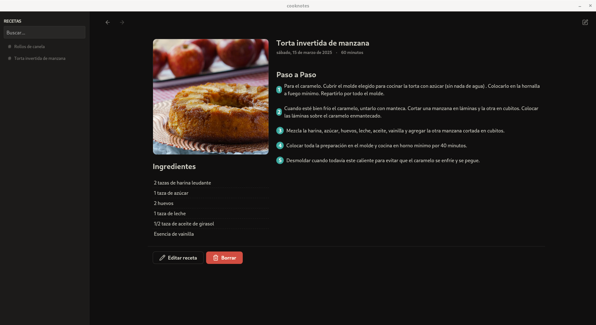
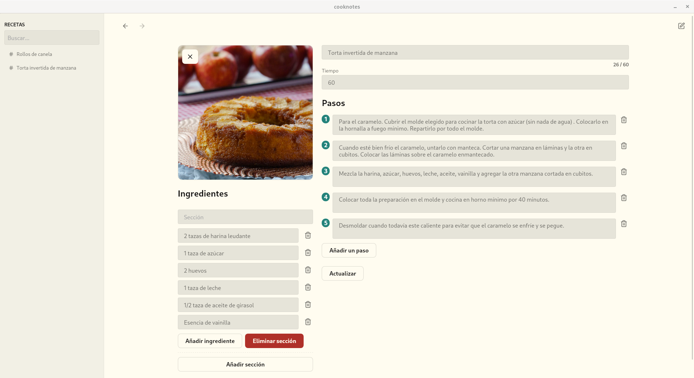
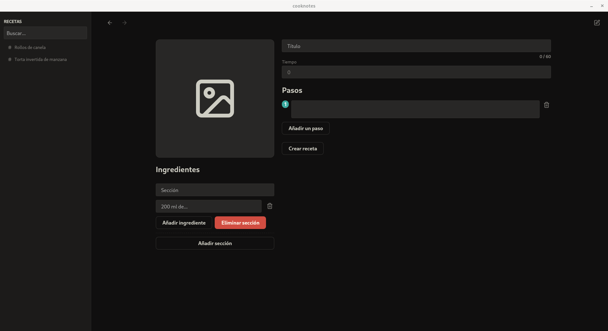

[Features](#features) •
[Planned Features](#planned-features) •
[Screenshots](#screenshots) •
[Downloads](#downloads) •
[Getting Started](#getting-started) •
[Motivation](#motivation) 

# Cooknotes

Cooknotes is a local-first recipe management app.

## ⭐ Features

- **Local Storage**: All your recipes are saved locally on your device, ensuring data privacy and offline access.
- **Recipe management**: Create, edit, and delete recipes easily.
- **Free and open source**
- **Easy to use and clean UI**
- **Dark mode and Light mode**

## 🆕 Planned Features

- **Last open recipes**: Last recipes you opened for quick access
- **Share your recipes with your friends**
- **Keyboard shortcuts**
- **Multi-language support**

Contributions and suggestions are always welcome.

## 🖼️ Screenshots









## 🚀 Getting started

To run the application locally, you need to install the required dependencies. Refer to the [Tauri documentation](https://v2.tauri.app/start/prerequisites/) for detailed instructions on setting up the development environment on different platforms.

This project uses the following versions:

- Node.js v22.14.0
- Rust v1.84.1

### 1. Clone the repository

```bash
git clone git@github.com:moaqz/cooknotes.git --depth 1
cd cooknotes
```

### 2. Install dependencies

```bash
pnpm install
```

### 3. Verify the installation

To confirm that all dependencies are correctly installed, run the following command:

```bash
pnpm tauri info
```

This will display information about the installed Tauri dependencies and their configuration on your platform.

### 4. Run the application

```bash
pnpm tauri dev
```

## 📦 Downloads

| Platform | Version  | Download |
| -------- | -------- | --------  |
| Windows  |  | Soon  |
| Linux    |  | Soon  |
| MacOS    |  | Soon  |

## Motivation

I'm exploring the world of pastry and wanted a place to store all my recipes without needing to register or rely on paid services. This led me to build a desktop application based on the philosophy [file over app](https://stephango.com/file-over-app), and why not, try a new technology **(Tauri)**.
