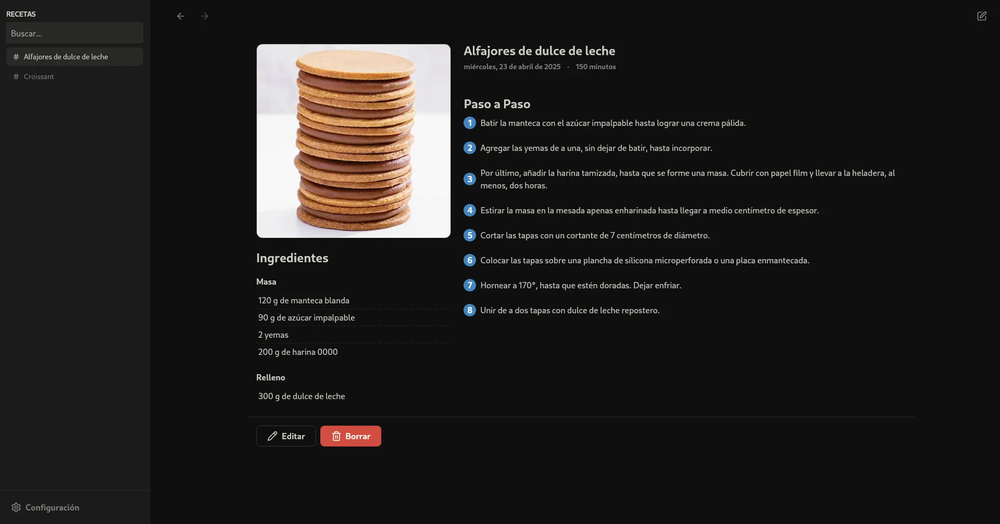
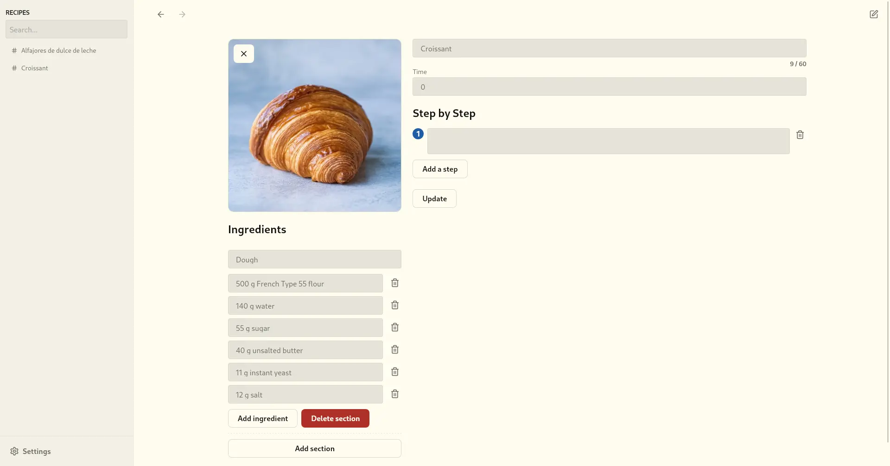
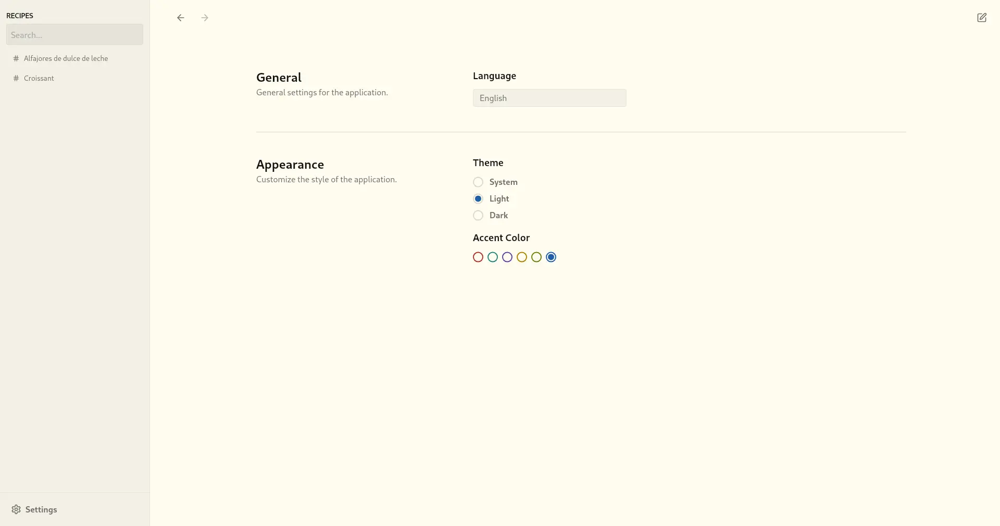

[Features](#-features) •
[Planned Features](#-planned-features) •
[Screenshots](#-screenshots) •
[Downloads](#-downloads) •
[Getting Started](#-getting-started)

# Cooknotes

Cooknotes is a local-only recipe management app.

## ⭐ Features

- **Local Storage**: All your recipes are saved locally on your device, ensuring data privacy and offline access.
- **Recipe management**: Create, edit, and delete recipes easily.
- **Free and open source**
- **Easy to use and clean UI**
- **Dark mode and Light mode**
- **Multi-language support**
- **Share your recipes as PDF**

## 🆕 Planned Features

- **Last open recipes**: Last recipes you opened for quick access
- **Keyboard shortcuts**
- **Import and export recipes in a single `.zip` or `.tar` file**

Contributions and suggestions are always welcome.

## 📸 Screenshots







## 🚀 Getting started

To run the application locally, you need to install the required dependencies. Refer to the [Tauri documentation](https://v2.tauri.app/start/prerequisites/) for detailed instructions on setting up the development environment on different platforms.

This project uses the following versions:

- Node.js v22.14.0
- Rust v1.84.1

### 1. Clone the repository

```bash
git clone git@github.com:moaqz/cooknotes.git --depth 1
cd cooknotes
```

### 2. Install dependencies

```bash
pnpm install
```

### 3. Verify the installation

To confirm that all dependencies are correctly installed, run the following command:

```bash
pnpm tauri info
```

This will display information about the installed Tauri dependencies and their configuration on your platform.

### 4. Run the application

```bash
pnpm tauri dev
```

## 📦 Downloads

| Platform | Version  | Download |
| -------- | -------- | --------  |
| Windows  |  | [Download](https://github.com/moaqz/cooknotes/releases/latest)  |
| Linux    |  | [Download](https://github.com/moaqz/cooknotes/releases/latest)  |
| MacOS    |  | [Download](https://github.com/moaqz/cooknotes/releases/latest)  |
